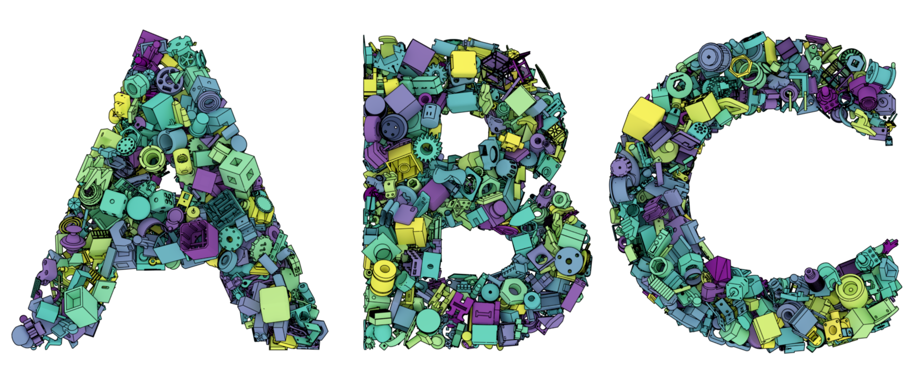
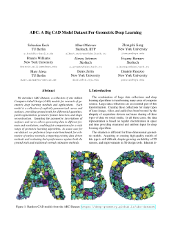
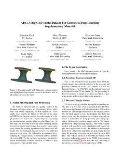

# News

> **(2019, April 24th)** Initial release including 1 million CAD models for step, parasolid, stl and meta formats.


* * *
<br>


# Dataset

<!--#### ABC: A Big CAD Model Dataset For Geometric Deep Learning-->

We introduce ABC-Dataset, a collection of one million Computer-Aided Design (CAD) models for research of geometric deep learning methods and applications. Each model is a collection of explicitly parametrized curves and surfaces, providing ground truth for differential quantities, patch segmentation, geometric feature detection, and shape reconstruction. Sampling the parametric descriptions of surfaces and curves allows generating data in different formats and resolutions, enabling fair comparisons for a wide range of geometric learning algorithms. As a use case for our dataset, we perform a large-scale benchmark for estimation of surface normals, comparing existing data driven methods and evaluating their performance against both the ground truth and traditional normal estimation methods. 




### Authors
Koch, Sebastian and Matveev, Albert and Jiang, Zhongshi and Williams, Francis and Artemov, Alexey and Burnaev, Evgeny and Alexa, Marc and Zorin, Denis and Panozzo, Daniele


### Acknowledgements

We are grateful to Onshape for providing the CAD models and support. This work was supported in part through the NYU IT High Performance Computing resources, services, and staff expertise. Funding provided by NSF award MRI-1229185. We thank the Skoltech CDISE HPC Zhores cluster staff for computing cluster provision. This work was supported in part by NSF CAREER award 1652515, the NSF grants IIS-1320635, DMS-1436591, and 1835712, the Russian Science Foundation under Grant 19-41-04109, and gifts from Adobe Research, nTopology Inc, and NVIDIA.

### Paper/Citation


<!--<div style="display: flex; justify-content: center; margin-bottom:20px;">-->
<a href="https://arxiv.org/pdf/1812.06216.pdf" target="_blank"></a>
<!---->
<!--</div>-->

Please cite our paper if you use the ABC dataset.

```
@InProceedings{Koch_2019_CVPR,
author = {Koch, Sebastian and Matveev, Albert and Jiang, Zhongshi and Williams, Francis and Artemov, Alexey and Burnaev, Evgeny and Alexa, Marc and Zorin, Denis and Panozzo, Daniele},
title = {ABC: A Big CAD Model Dataset For Geometric Deep Learning},
booktitle = {The IEEE Conference on Computer Vision and Pattern Recognition (CVPR)},
month = {June},
year = {2019}
}
```

### License

The copyright of the CAD models is owned by their creators. For licensing details, see [Onshape Terms of Use 1.g.ii](https://www.onshape.com/legal/terms-of-use#your_content){:target="_blank"}.


<!--### Statistics-->

<!--_Coming soon..._-->


* * *
<br>


# Download

By downloading the dataset you agree to the following terms:

* You will use the data exclusively under the Terms of Use of Onshape (see [License](#license)).
* The authors give no warranties regarding the data.


### Versions

The dataset is versioned to accommodate for future updates of some of the file formats. Currently, the latest version for all file formats is version **v00** (marked by the suffix of the data chunks).

### File Formats

Each model in the dataset consists of the following file formats: _Note: Not all file formats are available for all models due to processing errors, etc. The formats that are always available are meta, step, para, stl2._

| Format         | Description          | Name | Example |
|:---------------|:---------------------|:-----|:-----|
| Meta           | Meta information of the original Onshape documents in form of a yaml document. It lists the author and various other meta information of the CAD model. | meta | [yml](data/00000050_80d90bfdd2e74e709956122a_metadata_000.yml){:target="_blank"} | 
| Step | Step file format containing the parametric boundary representation (converted from Parasolid), see [format description](https://en.wikipedia.org/wiki/ISO_10303-21){:target="_blank"}.    | step | [txt](data/00000050_80d90bfdd2e74e709956122a_step_000.step){:target="_blank"} |
| Parasolid | Parasolid format containing the parametric boundary representation, see [format specification](https://github.com/jswitzer/cad/raw/master/doc/XT_Format_April_2008_tcm1023-62642.pdf){:target="_blank"}.  | para   | [zip](data/00000050_80d90bfdd2e74e709956122a_parasolid_000.zip){:target="_blank"} |
| Stl parts    |  STL models with parts stored separately in single files zipped together. The triangulation of the stl models is dense but the triangles have arbitrary shapes with possibly extreme interior angles. | stl | [7z](data/00000050_80d90bfdd2e74e709956122a_trimesh_000.zip){:target="_blank"} |
| Stl complete   | STL models with single parts merged together as one complete model. The triangulation of the stl models is dense but the triangles have arbitrary shapes with possibly extreme interior angles.  | stl2 | [binary](data/00000050_80d90bfdd2e74e709956122a_trimesh_000.stl){:target="_blank"} |
| Features    | Feature description in form of a list of surface patches and curves according to the description in the supplementary material. Vertex/Face indices correspond to the elements in the object file. Note: Vertices are 0-indexed here, whereas in the object file vertices are 1-indexed per default. | feat | [yml](data/00000050_80d90bfdd2e74e709956122a_features_000.yml){:target="_blank"} |
| Object    | Obj models with ground truth normals and curvature values at each vertex. The vertex and triangle indices correspond to the indices in the features file. Note: Vertices are 1-indexed here, whereas in the features file vertices are 0-indexed. | obj | [txt](data/00000050_80d90bfdd2e74e709956122a_trimesh_000.obj){:target="_blank"} |
| Images    | Renderings of the objects from canonical viewpoints that are produced with the processing pipeline.  | img | [png](data/00000050_80d90bfdd2e74e709956122a_image_000.png){:target="_blank"} |
| Statistics    | Statistical information about the CAD model (in parametric boundary representation) as well as the generated object file (triangle mesh).  | stats | [yml](data/00000050_80d90bfdd2e74e709956122a_stats_000.yml){:target="_blank"} |
| FeatureScript    | Original FeatureScript definition of the CAD model from Onshape. Represents the generation process of the CAD model.  | ofs | [yml](data/00000050_80d90bfdd2e74e709956122a_featurescript_000.yml){:target="_blank"} |


### Chunks
The dataset is split into compressed chunks of 10000 models according to the file formats. The following files list the urls for all file formats as well as for the single file formats for all chunks:&emsp;
[all](data/all.txt){:target="_blank"}&emsp;
[meta](data/meta.txt){:target="_blank"}&emsp;
[para](data/para.txt){:target="_blank"}&emsp;
[step](data/step.txt){:target="_blank"}&emsp;
[stl2](data/stl2.txt){:target="_blank"}


The chunks can then be downloaded for example with <span class="cin">wget</span> or <span class="cin">curl</span>. The following command downloads all meta file format chunks with 8 requests (maximum) in parallel into the folder _meta_:

```bash
cat meta.txt | xargs -n 1 -P 8 wget {} -P meta --no-check-certificate
```


### Checksums/Sizes
We provide md5 checksums and filesizes (in bytes) for all compressed chunks in the following yaml files to check for archive integrity: &emsp;
[md5](data/md5.yml){:target="_blank"}&emsp;
[size](data/size.yml){:target="_blank"}


* * *
<br>


# Benchmarks

Based on a subset of the CAD models from the ABC dataset, we provide the following benchmarks for the task of surface normal estimation.

### Normal Estimation

The surface normal estimation benchmark consists of meshed CAD models with fixed amounts of vertices (512, 1024 and 2048) and ground truth vertex normals derived from the parametric boundary representation. There is one benchmark for patches (parts) of CAD models and one for full CAD models.

_Coming soon..._


* * *
<br>


# Processing

For the processing of the step files, we provide [docker](https://www.docker.com/) and [singularity](https://singularity.lbl.gov/) containers that contain scripts for meshing, filtering, statistics and rendering.

### Modules

_Coming soon..._


